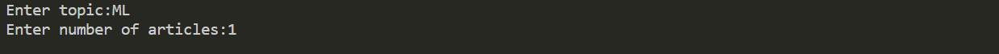
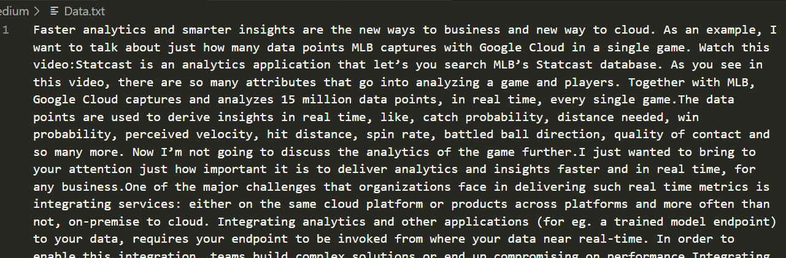

# Medium Scrapper
Running this Script would allow the user to scrape any number of articles from [medium.com](https://medium.com/) from any category as per the user's choice

## Setup instructions
In order to run this script, you need to have Python and pip installed on your system. After you're done installing Python and pip, run the following command from your terminal to install the requirements from the same folder (directory) of the project.
```
pip install -r requirements.txt
```

After completing all the requirements for the project, Open the terminal in the project folder and run
```
python medium.py
```


## Output
The user needs to enter Category and Number of articles



The scraped text files get saved in the folder in which the script is run



## Author
[Shaurya Gupta](https://github.com/Shaurya10101)